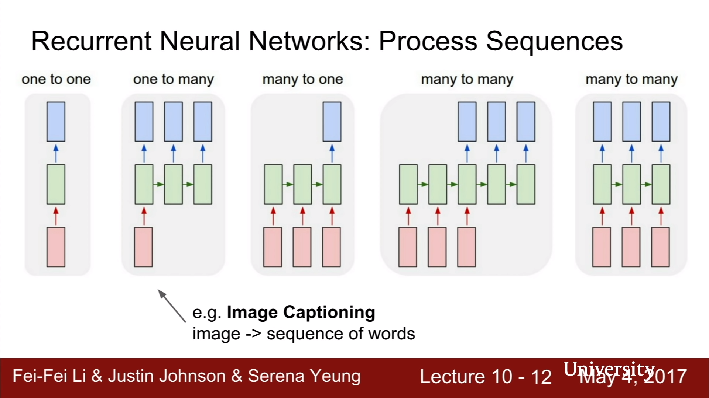
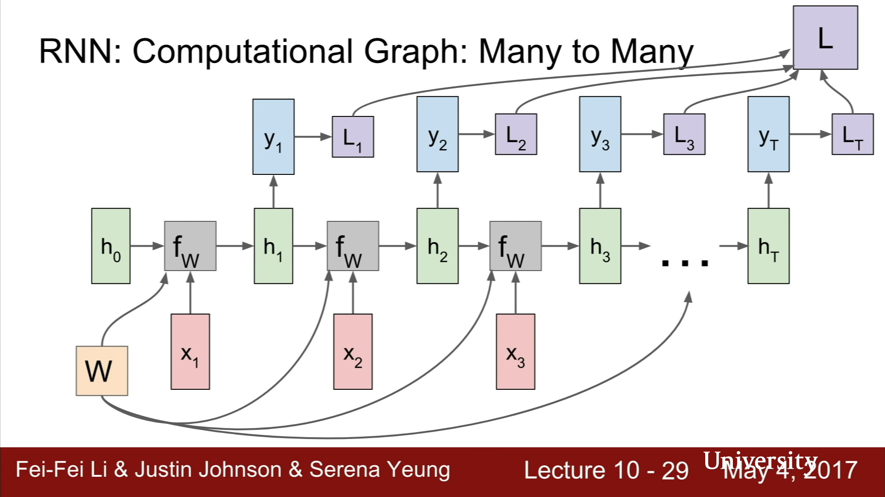
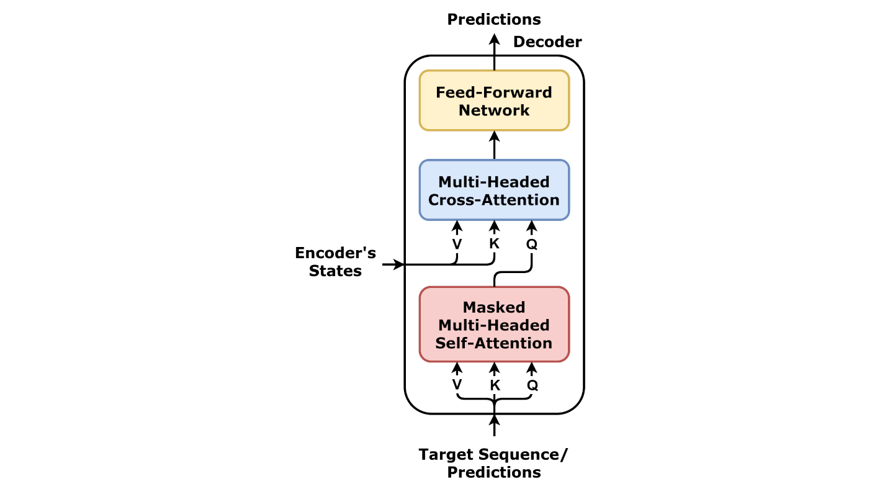
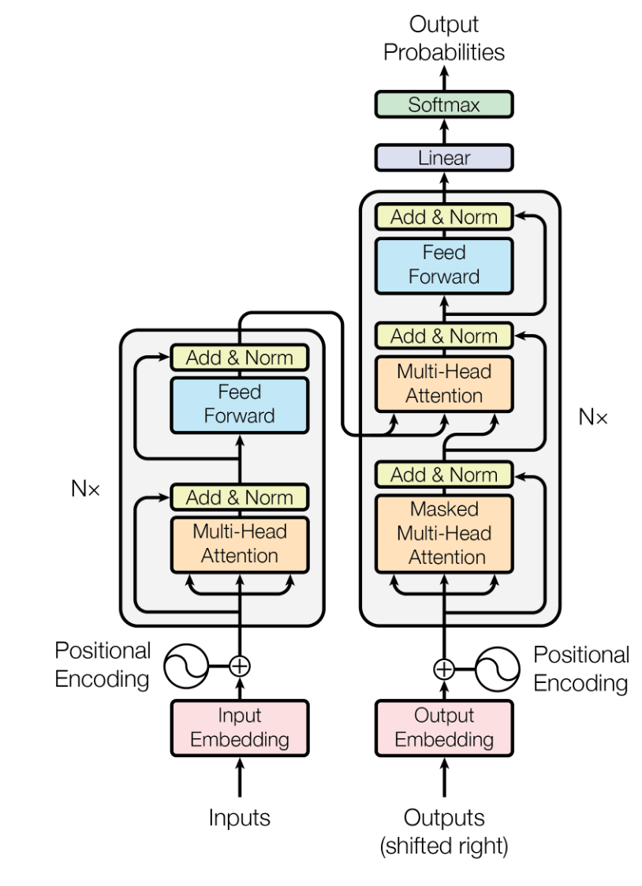

# Attention is All You Need (Vaswani et. al. 2017)

## Charitarth Chugh

### STAT 3494W

---

# Some Background: Previous Architectures

> _Based on and using some material from [Lecture 10 of Stanford CS231n, Spring 2017](https://www.youtube.com/watch?v=vT1JzLTH4G4&list=PL3FW7Lu3i5JvHM8ljYj-zLfQRF3EO8sYv)_

> _Convolution based architectures were mentioned in the Attention is All You Need paper, but will be ommitted here for simplicity_

---

# Recurrent Neural Network Architecture

- Neural network architecture that which processes sequences
- Store an internal hidden state that is updated with the following recurrence formula:
  $$
  h_t = f_w(h_{(t-1)}, x_t)
  $$
- Where
  - $h_t$ is the new state,
  - $h_{t-1}$ is the old state
  - $f_w$ is some function with parameters w
  - Use same function & weights at every time step
  - $x_t$ is the input vector at some time step

---

#### Simplest example: Vanilla RNN

$$
h_t = \text{tanh}(W_{hh}h_{t-1}, W_{xh}x_t)
$$

$$
y_t=W_{hy}h_t
$$

---

---

# Another Way to Look at RNNs: Computational Graph

---

# The Vanishing and Exploding Gradient Problem

- Gradients are repeatedly multiplied by weights during backpropagation through time. If weights are too small, gradients shrink (vanishing gradient), or if too large, they grow uncontrollably (exploding gradient).

- Vanishing gradients make it hard for RNNs to learn long-term dependencies, as the gradient becomes too small to update the weights effectively. Exploding gradients cause unstable learning, where large updates lead to poor convergence.

---

# Long-Short Term Memory Architecture

## A Potential Solution

> Image Credits: [Papers With Code](https://paperswithcode.com/method/lstm)

---

# The Three Memory Gates: Forget Gate

- **Forget Gate**: Controls what information to discard from the cell state.
  $$
  f_t = \sigma(W_f \cdot [h_{t-1}, x_t] + b_f)
  $$
  where:
  - $f_t$ is the forget gate vector.
  - $\sigma$ is the sigmoid function.
  - $W_f$ and $b_f$ are the weights and biases.
  - $h_{t-1}$ is the previous hidden state, and $x_t$ is the current input.

---

# The Three Memory Gates: Input Gate

- **Input Gate**: Decides what new information to store in the cell state.

  $$
  i_t = \sigma(W_i \cdot [h_{t-1}, x_t] + b_i)
  $$

  - $i_t$ is the input gate vector.

  **Candidate cell state**:

  $$
  \tilde{C}_t = \tanh(W_C \cdot [h_{t-1}, x_t] + b_C)
  $$

  - $\tilde{C}_t$ is the candidate new cell state.

  **Cell state update**:

  $$
  C_t = f_t \odot C_{t-1} + i_t \odot \tilde{C}_t
  $$

  - $C_t$ is the updated cell state.
  - $\odot$ is element-wise multiplication.

---

# The Three Memory Gates: Output Gate

- **Output Gate**: Controls the final output (hidden state) based on the cell state.
  $$
  o_t = \sigma(W_o \cdot [h_{t-1}, x_t] + b_o)
  $$
  **Hidden state**:
  $$
  h_t = o_t \odot \tanh(C_t)
  $$
  where:
  - $h_t$ is the current hidden state (LSTM output).

---

# Bidirectional RNNs With Attention

- Bidirectional RNNs: Process input sequences in both forward and backward directions to capture past and future context simultaneously.

  - Two RNNs (e.g., LSTMs or GRUs) run in parallel; one processes input left-to-right, the other right-to-left. Their outputs are concatenated. (e.g [ELMo](https://arxiv.org/pdf/1802.05365))

- Combining with attention mechanism it allows the model to focus on specific parts of the input sequence, dynamically weighting relevant information.

  $$
  \alpha_t = \frac{\exp(e_t)}{\sum_{t'} \exp(e_{t'})}, \quad e_t = \text{score}(h_t, s_{t-1})
  $$

  where $\alpha_t$ are attention weights, and $\text{score}$ measures the relevance between hidden state $h_t$ and the previous state $s_{t-1}$.

---

# Transformers

> The authors originally wondered - is there an architecture possible without RNNs using attention?

> Would alleviate the issues present in RNNs and address issues of parallelization

---

# Self vs Cross Attention & Positional Encodings

- Cross attention: using inputs from two models to get attention score
- Self Attention: Computing attention score against itself, to capture the dependencies between inputs
- What about positional information?
  - Positional encodings is a (learnable) parameter injected into the model detailing the location of a part of th input (token).

---

# Scaled Dot Product Attention

> Image Credits: [d2l.ai](https://d2l.ai)

$$ \mathrm{softmax}\left(\frac{\mathbf Q \mathbf K^\top }{\sqrt{d_k}}\right) \mathbf V \in \mathbb{R}^{n\times v}.$$

---

# Multi-headed Attention

- Instead of computing SDPA on all of the input, linearly project $Q$, $K$, $V$ $h$ times with different learned projections to $d_k$ that are pooled together using a linear layer
- Allows the model to jointly attend to information from different representation subspaces at different positions
  

---

# Encoder Only

> Image Credit: [PyTorch](https://pytorch.org/blog/a-better-transformer-for-fast-transformer-encoder-inference/)

- LayerNorm and Residual Connections: essential practice to train deep networks

---

# Decoder Only
> By dvgodoy - <a rel="nofollow" class="external free" href="https://github.com/dvgodoy/dl-visuals/?tab=readme-ov-f">GitHub</a>, <a href="https://creativecommons.org/licenses/by/4.0" title="Creative Commons Attribution 4.0">CC BY 4.0</a>, <a href="https://commons.wikimedia.org/w/index.php?curid=151216016">Link</a>

---

# Encoder Decoder

> A presented in original paper

